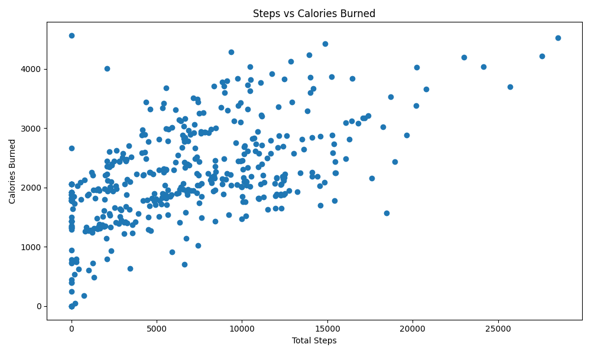

# Fitness Activity Data Analysis (Fitbit Dataset)

---

## Overview
This project analyses Fitbit activity data to explore the relationship between physical activity, calorie expenditure, and performance metrics.

---

## Objective
The objective of this project is to analyse fitness tracker data to understand the relationship between physical activity, calorie expenditure, and behavioural patterns. This project explores how data can be used to gain insights into performance and lifestyle habits.

---

## Dataset
- Source: Fitbit dataset (Kaggle)  
- Includes:
  - Daily steps
  - Calories burned
  - Activity intensity levels
  - Time-based activity tracking  

---

## Key Questions
- How does physical activity relate to calorie expenditure?
- Do higher step counts always result in higher calorie burn?
- What patterns exist in user activity behaviour?

---

## Tools & Technologies
- Python
- pandas (data manipulation)
- matplotlib (data visualisation)

---

## Methodology
1. Data Cleaning  
   - Removed missing and inconsistent data  
   - Standardised date and activity formats  

2. Exploratory Data Analysis (EDA)  
   - Analysed relationships between steps and calories  
   - Examined daily activity trends  
   - Identified behavioural patterns  

3. Data Visualisation  
   - Created charts to highlight correlations and trends  

---

## Key Insights
- Higher step counts generally correlate with increased calorie expenditure, but intensity of activity plays a significant role  
- Users with consistent daily activity tend to show more stable performance metrics  
- Behavioural patterns suggest that consistency may be more important than short bursts of high activity  

---

## Insights & Interpretation
- Data can be used to personalise fitness recommendations  
- Activity tracking enables behavioural insights that can improve long-term health outcomes  
- Consistency in activity is a key driver of performance, not just intensity

---

## Example Visual

### Steps vs Calories

## Dataset
Fitbit Fitness Tracker Data

---

## Conclusion
This project demonstrates how data analysis can be applied to real-world behavioural data. It highlights the value of data-driven insights in understanding performance, habits, and lifestyle patterns.

---

## Links
- Kaggle notebook: (https://www.kaggle.com/code/siripiruntans/fitness-data-analysis-project)
